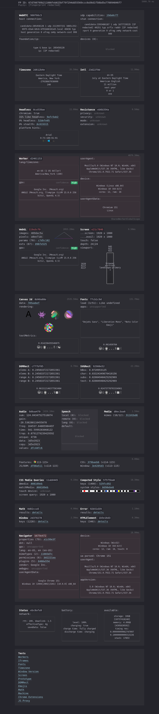
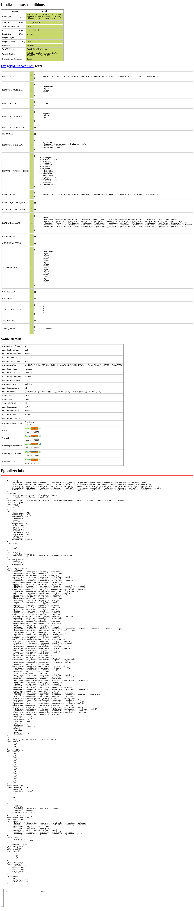

# stealth-oxide

`stealth-oxide` applies configurable, typed Chrome DevTools Protocol patches to
an existing [`chromiumoxide`](https://crates.io/crates/chromiumoxide) page.

The crate provides Playwright-Stealth-style control: start with recommended
defaults or no patches, enable or disable operations independently, preserve
native browser values, and override every modeled value. Browser launch,
proxies, authentication, page creation, navigation, and lifecycle remain under
the application's control.

## Browser-test container captures

The project container applies a coherent Windows desktop profile before page
scripts run. This full-page CreepJS report was captured only after its main
fingerprint sections, ratings, and page height had finished loading. Observed
network addresses are redacted before the PNG is written.



The same container profile also produces this fully loaded Sannysoft report:



This is a reproducible environment snapshot, not a guarantee about how any
third-party security or fraud-detection service will classify a browser.

## Installation

Add the crate and its browser-runtime dependencies:

```toml
[dependencies]
stealth-oxide = "0.1.0"
chromiumoxide = "0.9.1"
anyhow = "1"
futures = "0.3"
tokio = { version = "1", features = ["macros", "rt-multi-thread"] }
```

Rust 1.86 or newer is required by the resolved Chromiumoxide dependency graph.

Profile seeding is optional and disabled by default. Enable it explicitly only
when an application needs reproducible test cookies or origin storage:

```toml
[dependencies]
stealth-oxide = {
    version = "0.1.0",
    features = ["seeding"]
}
```

## Recommended configuration

Create an `about:blank` page, apply the configuration, and navigate only after
patching succeeds:

```rust,no_run
use anyhow::Result;
use chromiumoxide::{Browser, BrowserConfig};
use futures::StreamExt;
use stealth_oxide::StealthConfig;

#[tokio::main]
async fn main() -> Result<()> {
    let browser_config = BrowserConfig::builder()
        .build()
        .map_err(anyhow::Error::msg)?;
    let (mut browser, mut handler) = Browser::launch(browser_config).await?;
    tokio::spawn(async move {
        while let Some(event) = handler.next().await {
            if let Err(error) = event {
                eprintln!("chromiumoxide handler error: {error:?}");
            }
        }
    });

    let page = browser.new_page("about:blank").await?;
    let report = StealthConfig::recommended().apply(&page).await?;
    page.goto("https://example.com").await?;

    println!("applied patches: {:?}", report.applied());
    browser.close().await?;
    Ok(())
}
```

`recommended()` selects the platform matching the Rust target. A preset
describes the requested browser identity; it cannot transform the underlying
operating system, GPU, fonts, voices, or platform-only browser features.

## Granular control

Every patch can use an override, preserve Chromium's native value, or be
disabled:

```rust
use stealth_oxide::{Patch, PatchState, StealthConfig};

let config = StealthConfig::recommended()
    .disable(Patch::Screen)
    .use_native(Patch::Touch)
    .timezone("America/Toronto")
    .languages(["en-CA", "en"])
    .locale("en-CA");

assert_eq!(config.patch_state(Patch::Screen), PatchState::Disabled);
assert_eq!(config.patch_state(Patch::Touch), PatchState::Native);
```

Available patches are:

- `Identity`: user agent, navigator platform, languages, and UA Client Hints
- `Locale`: Intl locale
- `Timezone`: IANA timezone
- `Screen`: screen dimensions and device scale factor
- `MediaFeatures`: color scheme, reduced motion, forced colors, color gamut,
  and monochrome depth
- `Touch`: touch enablement and maximum touch points

Start with no patches and opt in explicitly:

```rust
use stealth_oxide::{Patch, StealthConfig};

let config = StealthConfig::none()
    .enable(Patch::Identity)
    .enable(Patch::Locale)
    .enable(Patch::Timezone);
```

## Platform presets and typed values

```rust
use stealth_oxide::{
    ColorGamut, ColorScheme, ForcedColors, PlatformProfile, ReducedMotion,
    StealthConfig,
};

let config = StealthConfig::for_platform(PlatformProfile::Windows)
    .screen_size(2560, 1440)
    .device_scale_factor(1.25)
    .color_scheme(ColorScheme::Dark)
    .reduced_motion(ReducedMotion::NoPreference)
    .forced_colors(ForcedColors::None)
    .color_gamut(ColorGamut::Srgb)
    .touch(false, 0);
```

Complete typed patch values can also be supplied with `identity_patch`,
`locale_patch`, `timezone_patch`, `screen_patch`, `media_features_patch`, and
`touch_patch`.

## Consistency policies

Strict validation is the default. It rejects known contradictions before any
CDP command runs:

```rust
use stealth_oxide::{ConsistencyPolicy, PlatformProfile, StealthConfig};

let config = StealthConfig::for_platform(PlatformProfile::Linux)
    .navigator_platform("Win32")
    .consistency_policy(ConsistencyPolicy::Warn);

let issues = config.validation_issues();
assert!(!issues.is_empty());
```

- `Strict` rejects known contradictions before applying patches.
- `Warn` applies valid CDP values and returns issues in `ApplyReport`.
- `Permissive` applies the requested values and skips coherence checks. CDP
  parameter requirements and Chromium errors still apply.

Application is sequential, not transactional. If Chromium rejects a later
patch, the error records which earlier patches completed successfully.

## Proxies

Proxy configuration and credentials belong to the application and
Chromiumoxide. `stealth-oxide` never receives or stores them.

```rust,no_run
use chromiumoxide::auth::Credentials;
use chromiumoxide::{Browser, BrowserConfig};
use futures::StreamExt;
use stealth_oxide::StealthConfig;

# async fn example() -> anyhow::Result<()> {
let config = BrowserConfig::builder()
    .arg(("proxy-server", "http://proxy.example:8080"))
    .build()
    .map_err(anyhow::Error::msg)?;
let (mut browser, mut handler) = Browser::launch(config).await?;
tokio::spawn(async move {
    while let Some(event) = handler.next().await {
        if let Err(error) = event {
            eprintln!("chromiumoxide handler error: {error:?}");
        }
    }
});

let page = browser.new_page("about:blank").await?;
page.authenticate(Credentials {
    username: "username".into(),
    password: "password".into(),
})
.await?;
StealthConfig::recommended().apply(&page).await?;
page.goto("https://example.com").await?;
browser.close().await?;
# Ok(())
# }
```

Retries, reloads, and profile lifecycle also remain application concerns.
`stealth-oxide` never automatically revisits a URL after a blocked response.

## Examples

The public examples focus on using the crate as a dependency:

```bash
cargo run --example basic
cargo run --example custom_configuration
cargo run --example custom_profile
cargo run --features seeding --example profile_seeding
docker compose run --rm stealth-oxide cargo run --example creepjs_screenshot
docker compose run --rm stealth-oxide cargo run --example sannysoft_screenshot
```

`basic` is the smallest complete browser example: it launches Chromium, keeps
the Chromiumoxide event handler running, applies the recommended configuration
before navigation, and prints the page title and applied patches.
`custom_configuration` demonstrates
Playwright-Stealth-style opt-in, native, and override controls without launching
a browser. `custom_profile` builds and applies a coherent typed Windows profile.
`creepjs_screenshot` and `sannysoft_screenshot` wait for their respective
reports and save the full-page images shown above when run in the project
container. `profile_seeding` shows the optional seeding API with one in-memory
cookie.

Library users must also opt in at runtime by calling `apply_profile_seeds`:

```rust,no_run
# #[cfg(feature = "seeding")]
# async fn seed(page: &chromiumoxide::Page) -> stealth_oxide::Result<()> {
use stealth_oxide::{CookieSeed, ProfileSeed, apply_profile_seeds};

let seeds = [ProfileSeed::new().cookie(
    CookieSeed::new("test-session", "value", "https://example.com/")
        .secure(true)
        .http_only(true),
)];

apply_profile_seeds(page, &seeds).await?;
# Ok(())
# }
```

Omit the `seeding` feature—or simply do not call `apply_profile_seeds`—to seed
nothing. Passing an empty slice is also a no-op.

CreepJS probes live under `tests/` as ignored browser diagnostics. See
[`tests/README.md`](tests/README.md) for the container commands.

## Container development

The repository Docker environment supplies Chromium, Xvfb, Openbox, a taskbar,
and Mesa llvmpipe for integration tests. These assets are excluded from the
published crate archive.

```bash
docker compose build
docker compose run --rm stealth-oxide
```

## Verification

```bash
cargo fmt --check
cargo clippy --all-targets --all-features -- -D warnings
cargo test --all-targets
RUSTDOCFLAGS="-D warnings" cargo doc --no-deps
cargo package
```

Real-browser integration tests are ignored by default because they require a
working Chromium process and, for desktop tests, the container environment.

## Scope and limitations

- Patches use CDP rather than page-world JavaScript overrides.
- CDP commands are target- and session-scoped.
- Applying a configuration to one page does not automatically cover workers,
  popups, service workers, or new targets.
- Native screen work area, physical GPU identity, fonts, voices, and platform
  features can depend on the host environment.
- Successful navigation does not establish a favorable classification by a
  third-party fraud or bot-management service.
- Only test sites and proxies you are authorized to use.
